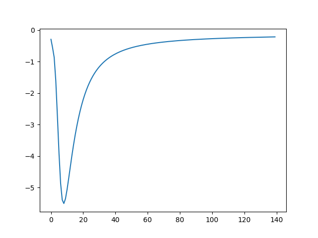
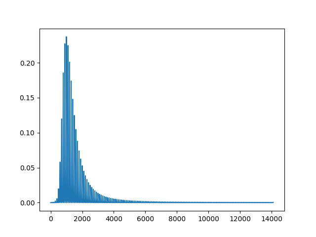
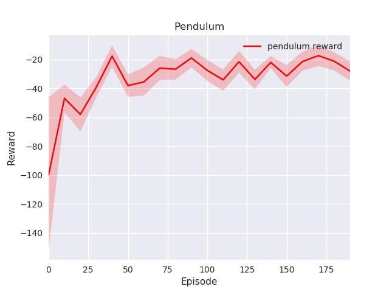
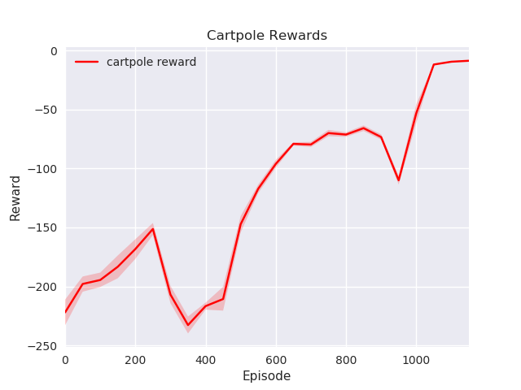
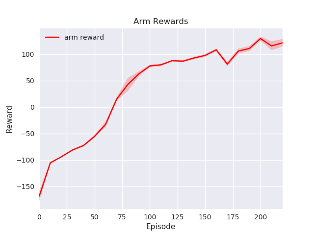
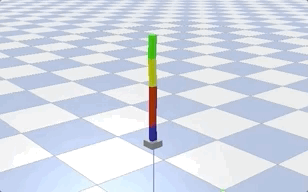
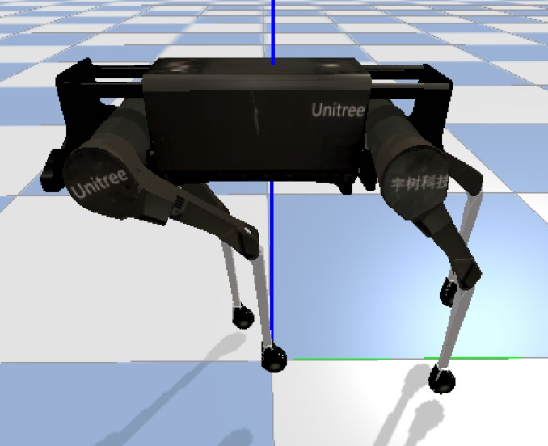

# RobLAX

## Description
<!-- This simulator contains several simple robotic envs written in [JAX](https://github.com/google/jax) and with a Neural Network controller implemented. A render and urdf parser also included to extend to more realistic robotic application. -->
RobLAX is a differentiable rigid body physics engine with contact1constraints that can assists various model-based methods.
RobLAX is written in JAX and implements [environments](envs) and [model-base algorithm](model_based_RL.py) using [jbdl](https://github.com/Tencent-RoboticsX/jbdl). A render and urdf parser also included to extend to more realistic robotic application.

RobLAX also includes a suite of learning algorithms that train agents in seconds to minutes:
*   Baseline learning algorithms such as
    [PPO](https://github.com/michaelyeah7/roblax/blob/Guo/PPO.py),
    [SAC](https://github.com/michaelyeah7/roblax/blob/Guo/SAC.py).
*   An new actor-critic mbrl algorithm, Model-based Reinforcement Learning


## Model-based Reinforcement Learning
Implement an actor-critic mbrl algorithm. Guo Ye, Qinjie Lin, Tim Lau, Zhaoran Wang, Han Liu.

<!-- The total reward of cartpole experiment(140 episodes).

The value loss of cartpole experiment. 
 
```
python examples/cartpole_main.py
``` -->


## Envs
### Pendulum


### Cart Pole



Control the cartpole using manually calculated forward dynamics. Training converges at very fast speed(first two episodes). The cartpole can keep upright for 200 timesteps.

Training time takes 2 hours for 100 episodes on MAC. Can't tell any convergence from loss graph. The cartpole can keep upright for 57 timesteps.
```
python examples/cartpole_NN_rbdl.py
```

### 7-link Arm Robot


A 7 link arm robot contains 6 joints. The first base_link to arm_link_0 fixed joint will be interpreted as prismatic joint (rbdl index 1) by rbdl. The remaining 5 joints are revolute joints (rbdl index 0).

```
python examples/arm_NN_rbdl.py
```
The goal is to reach a fixed pose (keep second-to-last joint 90 degrees), with only 20 episodes of training, it can reach the goal within 10cm.

### Quadropedal Robot
This is a quadrupedal robot(UNITREE) rendered using a pre-generated trajectory.
<!--  -->

```
python examples/quadrupedal_NN.py
```
The goal is to lift front-left and hid-right leg 90 degrees, with around 200 episodes, robot can reach the goal.


<!-- ### Rocket Landing

Control a rocket to landing. -->

<!-- ### Rigid Body
 -->

## QuickStart

Run on Magics Cluster

1. launch an ubuntu18 instance with tag cuda11.2
2. Install miniconda 
    ```
    wget https://repo.anaconda.com/miniconda/Miniconda3-latest-Linux-x86_64.sh
    ```
3. create env and install dependencies
    ```
    pip install -r requirements.txt
    #upgrade jaxlib to cuda11 version
    pip install --upgrade jax jaxlib==0.1.61+cuda111 -f https://storage.googleapis.com/jax-releases/jax_releases.html
    #enable GL 
    export MESA_GL_VERSION_OVERRIDE=4.3
    export PYTHONPATH=$PYTHONPATH:$PWD
    XLA_FLAGS=--xla_gpu_cuda_data_dir=/usr/local/cuda-11.2 python examples/cartpole_NN.py
    ```

## Citing RobLAX
If you would like to reference Roblax in a publication, please use:
```
@software{roblax2021github,
  author = {Guo Ye, Qinjie Lin, Tim Lau, Zhaoran Wang, Han Liu},
  title = {Roblax - A Fully Differentiable Rigid Body Simulator for Robotic Control},
  url = {http://github.com/michaelyeah7/roblax},
  version = {0.1.4},
  year = {2021},
}
```
